

  

Jmix Petclinic is a Jmix platform example application dealing with the domain of a petclinic. It is based on the commonly known [Spring Petclinic](https://github.com/spring-projects/spring-petclinic) example.

The Jmix Petclinic application deals with the domain of a Pet clinic and the associated business workflows to manage a pet clinic.

## Online Demo

The demo of the Jmix Petclinic is available on: https://demo.jmix.io/petclinic

## Application Overview

### Functionalities

Jmix Petclinic consists mainly of the following functionalities:

* Manage Pet Visits through a Calendar
* Track Visit Treatments for Nurses
* Create Pets and Owners
* Manage Nurses and Veterinarian of the Petclinic  

### Screenshots

#### Login

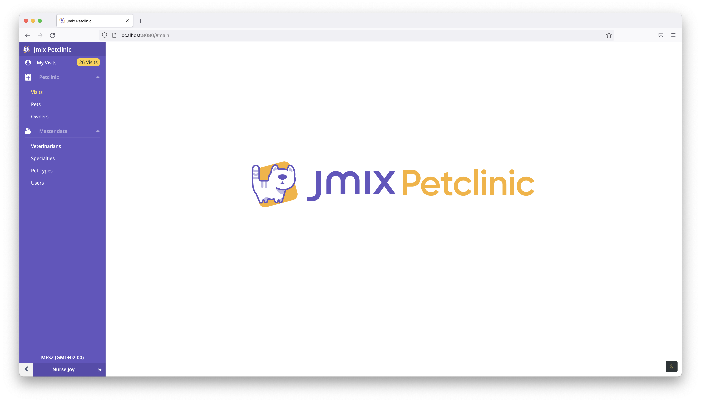

#### Visits
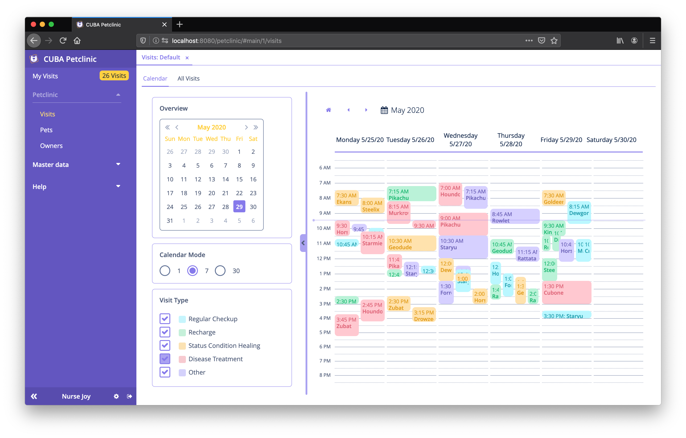
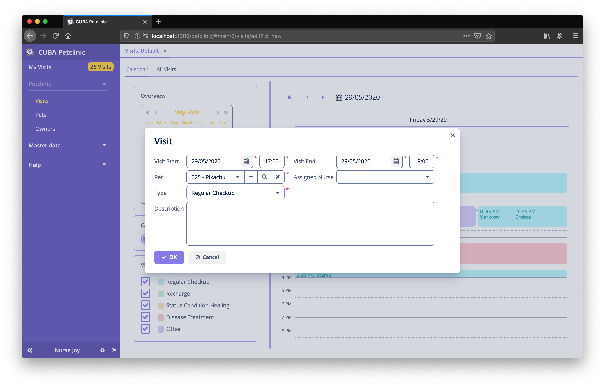
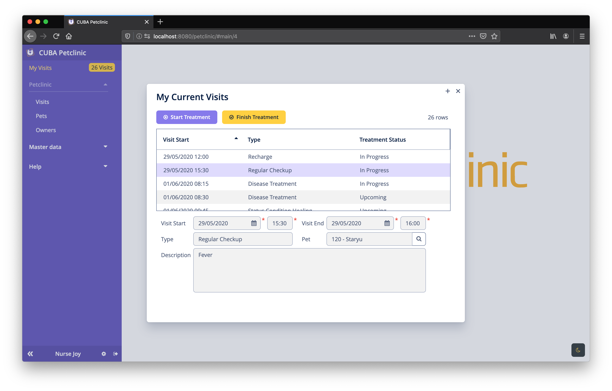
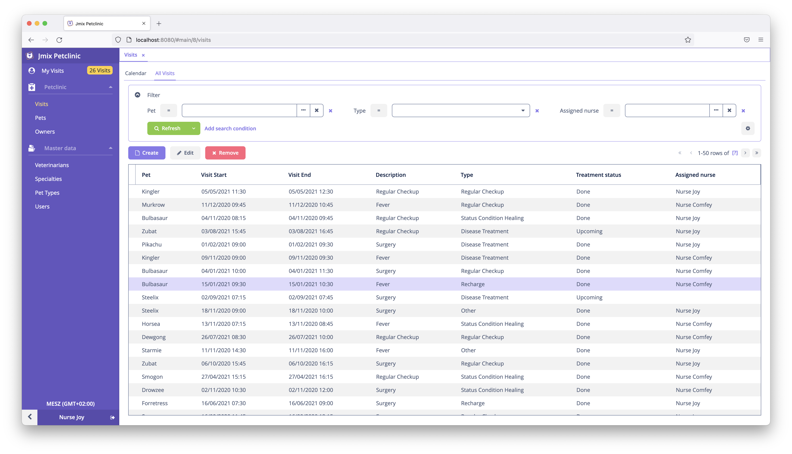
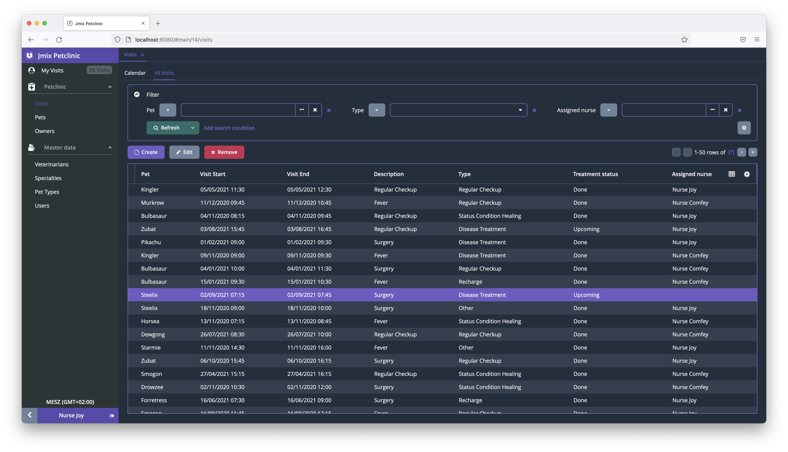
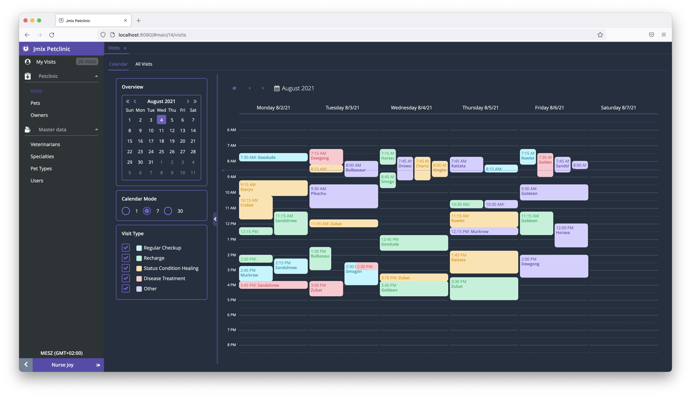

#### Owners & Pets
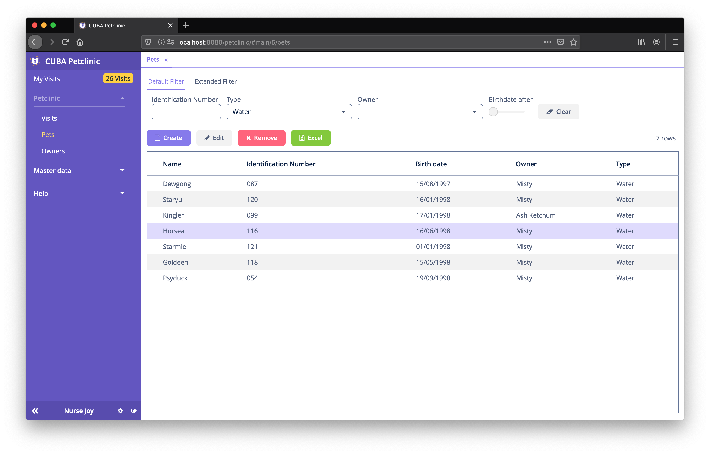
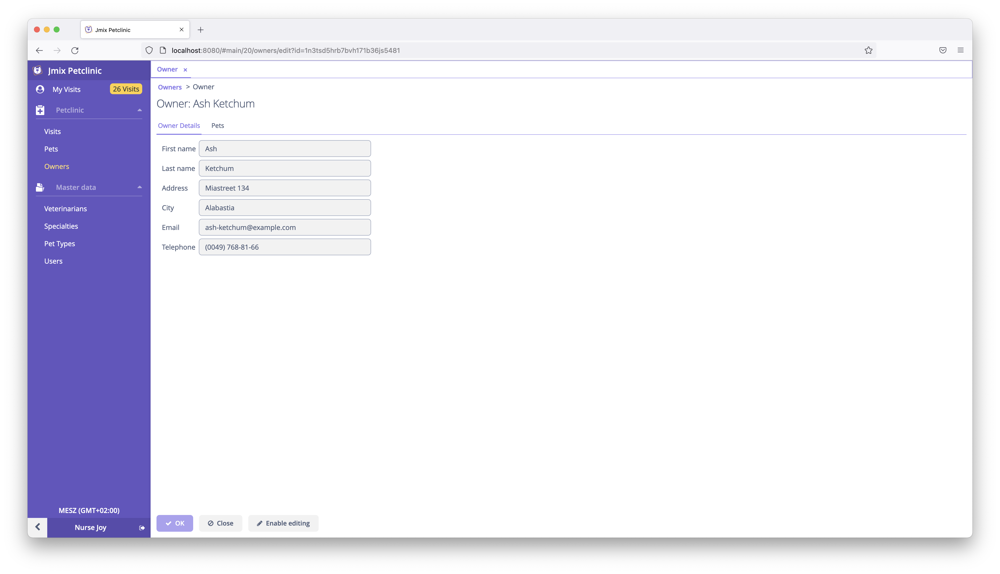
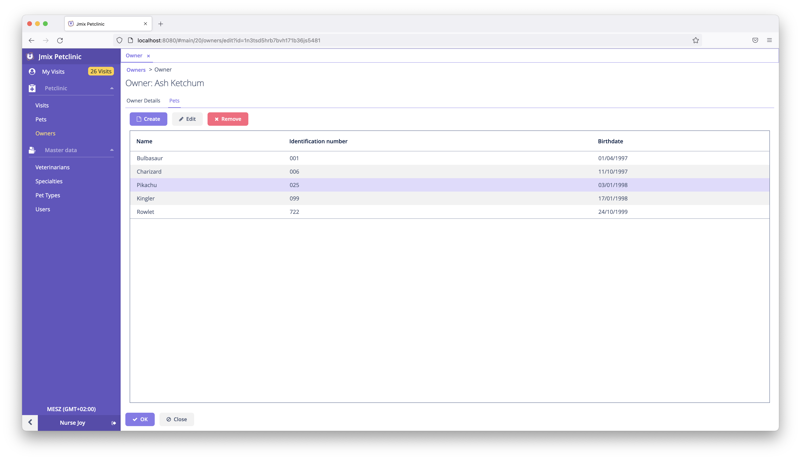
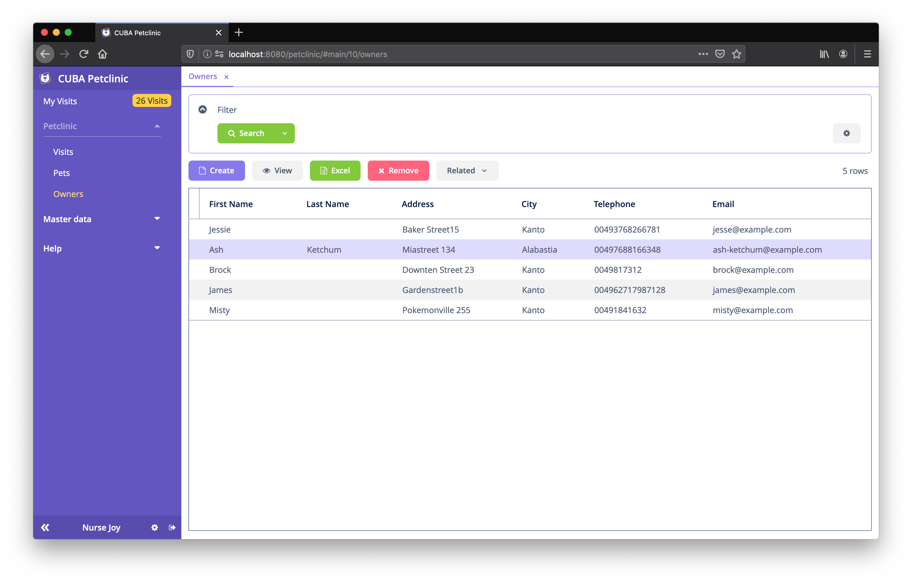

## Domain Model

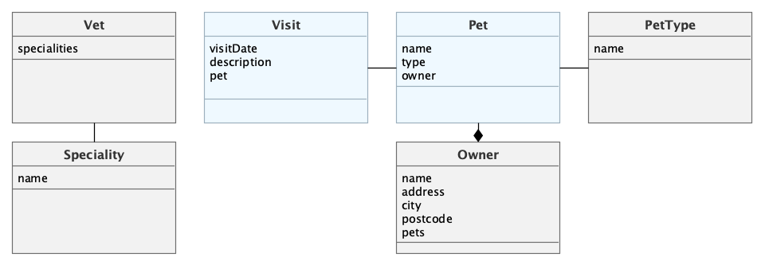

